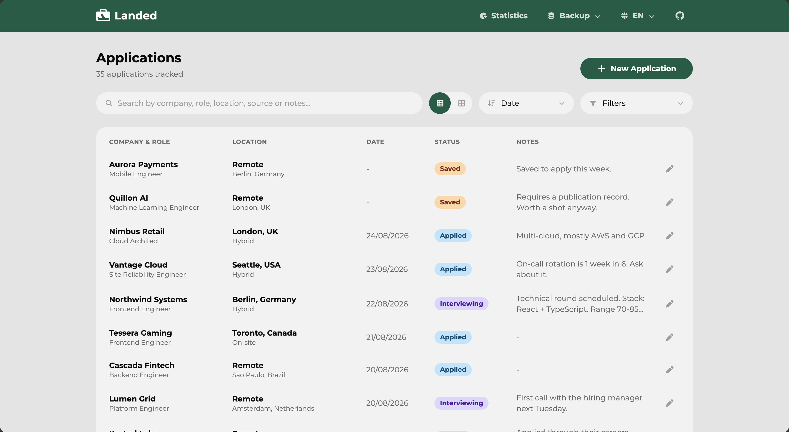
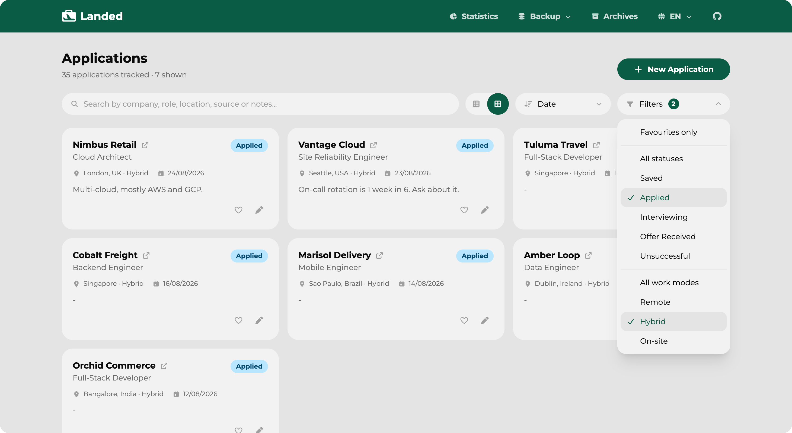
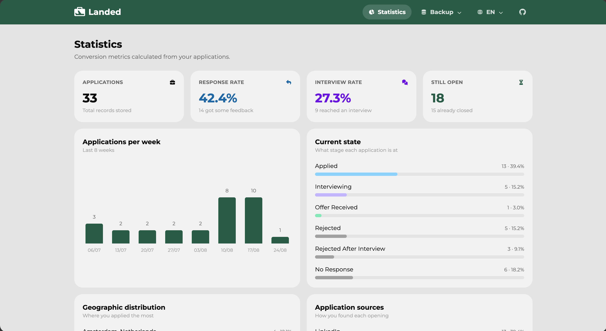

<div align="center">


# Landed

Job application tracker that keeps your data on your machine, deployed at [**landed.rodrigograc4.com**](https://landed.rodrigograc4.com)

[](https://github.com/rodrigograc4/Landed/actions/workflows/build.yml)
[](https://github.com/rodrigograc4/Landed/actions/workflows/tests.yml)
[](LICENSE)
[](package.json)

</div>

Job hunting means keeping track of dozens of applications, and the tools for it
either want an account, a subscription, or both. Landed is a single page that
runs in your browser: no sign-up, no backend, no analytics. Your applications
live in your own `localStorage` and never leave the device.

## Features

- **Track every application**: company, role, location, work mode, status,
  date, where you found it, a link to the posting and free-form notes.
- **Favourites**: mark the applications you care about with a heart, and
  filter to see only those.
- **Two views**: a dense table for scanning, cards for browsing. Your choice is
  remembered.
- **Search, filter and sort**: full-text search across company, role, location,
  source and notes; filter by favourites, statuses and work modes; sort
  by date, alphabetically, or by how far each application got.
- **Automatic no-response detection**: an application still marked _Applied_
  after 30 days becomes _No Response_ on its own, so a stale pipeline looks
  stale instead of looking busy.
- **Statistics**: response and interview rates, what stage everything is at,
  where you applied, how you found each opening, and volume per week over the
  last 8 weeks.
- **Backup you control**: export everything to a JSON file, import it back,
  merging with what is there or replacing it. Invalid entries are skipped, never
  imported half-broken. A CSV export is there too, for spreadsheets.
- **English and Portuguese**: detected from your browser, switchable at any
  time.

## Interface

### List view



The default view, built for scanning a long pipeline. Each row carries the
company and role together, where the job is and under what work mode, the date,
the current status as a colour-coded badge, and the start of your notes. Notes
are clamped to two lines, click anywhere on the row to expand them in place and
click again to collapse. The heart on the left marks a favourite, and turns
into a briefcase once an application is _Landed_. The pencil on the right opens
the application for editing, and the arrow next to a company name opens the
original posting in a new tab.

### Card view



The same applications laid out as cards for when you want to read rather than
scan, and the view that works best on a phone. Notes behave exactly as they do
in the list: two lines, click the card to expand. The toggle in the toolbar
switches between the two views and your choice is remembered for the next visit.

Open here is the filter menu, which holds a favourites-only switch, statuses and
work modes in one place, split by dividers. Both groups are multi-select and independent, so the screen
above is showing applications that are applied _and_ hybrid. Picking an option
does not close the menu, since you are usually choosing more than one, and the
badge on the button counts what is active so a filtered list never looks like
the full one. The entry at the top of each group clears that group back to
everything.

### Statistics



Everything here is calculated from your own applications, live. The four cards
across the top give the totals and the two rates that actually matter: how often
you hear back at all, and how often that turns into an interview. Below them,
your volume per week over the last 8 weeks, which stage everything is currently
at, where you have been applying, and which sources are actually producing
results. Saved postings are excluded from every metric, since you have not
applied to them yet and counting them would only drag the rates down.

## Privacy

Landed collects nothing. There is no backend, no account, no analytics and no
tracking of any kind, and the app never makes a network request with your data.

Your applications are stored only in your own browser, under the
`landed:applications` key in `localStorage`. They never leave your device, and
they are not readable by anyone else, including me. The same goes for your
language and view preferences.

Two consequences worth knowing:

- **Clearing your browser data deletes everything.** So does using a different
  browser or device, since nothing is synced. Use Export now and then to keep a
  copy of your applications as a JSON file you control.
- **Whoever hosts this site may keep standard server logs** (IP address, user
  agent, requested page), as any web server does. That is the host's doing, not
  the app's, and is covered by their own privacy policy.

`localStorage` is used purely to make the app work, not to track you, so there
is nothing here that requires a cookie banner.

## Running it locally

Requires Node 20.19 or later, which is what Vite 7 needs. CI runs on Node 22.

```bash
git clone https://github.com/rodrigograc4/Landed.git
cd Landed
npm install
npm run dev
```

| Script               | What it does                        |
| -------------------- | ----------------------------------- |
| `npm run dev`        | Development server with hot reload  |
| `npm run build`      | Production build into `dist/`       |
| `npm run preview`    | Serves the production build locally |
| `npm run lint`       | ESLint over the whole project       |
| `npm test`           | Runs the test suite once            |
| `npm run test:watch` | Runs the tests in watch mode        |

## Deploying your own copy

The build is a static site, so any host will serve it. The one thing it needs is
a rewrite sending every path to `index.html`, since routing happens in the
browser and a refresh on `/stats` would otherwise return a 404.

[vercel.json](vercel.json) already carries that rule for Vercel: import the
repository and the defaults do the rest. For Netlify, add a `public/_redirects`
file containing `/*    /index.html   200`.

## Tech stack

React 19, Vite 7, Tailwind CSS 4, React Router 7, Framer Motion for the
animations, Font Awesome for the icons and Vitest for the tests. No state
management library and no UI kit: the components are all in `src/components`.

## Project layout

```
src/
├── components/   Presentational components, one concern each
├── hooks/        useApplications (the store), useDismiss, useModalLayer
├── i18n/         Provider, context and the en/pt dictionaries
├── pages/        Applications and Stats
└── utils/        Normalisation, storage, backup, statistics, constants
tests/            Unit tests for the utils and the dictionaries
examples/         A sample backup file to import and try the app with
```

Every application that enters the app, typed into the form, read from
`localStorage`, or imported from a file, goes through `normalizeApplication`
first, so the rest of the code can assume valid data.

## Backup format

Export writes a file named `landed-YYYY-MM-DD.json`:

```json
{
  "format": "landed-backup",
  "app": "1.0.0",
  "exportedAt": "2026-08-26T23:12:13.000Z",
  "applications": [
    { "id": "app_...", "company": "...", "role": "...", "updatedAt": "..." }
  ]
}
```

`app` records the version of Landed that wrote the file, useful when someone
reports a problem with one. Nothing in the file decides how it is read: import
looks at the applications and normalises whatever it finds.

Import also accepts a bare array of applications, so a hand-written or
hand-edited file still works.

[examples/landed-sample.json](examples/landed-sample.json) holds 35 invented
applications in exactly this format, if you want to see the app with something
in it before entering your own.

Merging compares `updatedAt` and keeps whichever copy of an application was
edited last, so importing an older file never overwrites a newer edit. Entries
without a timestamp, such as those from a backup taken before this existed,
count as the older side.

## Contributing

Issues and pull requests are welcome. Please run `npm run lint` and `npm test`
before opening one, both run in CI on every push.

[ROADMAP.md](ROADMAP.md) lists what could come next, and why some things
deliberately will not.

## License

[MIT](LICENSE) © 2026 Rodrigo Graça
